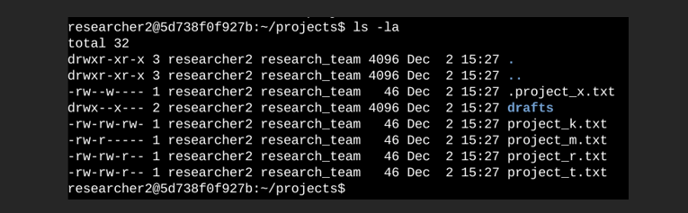
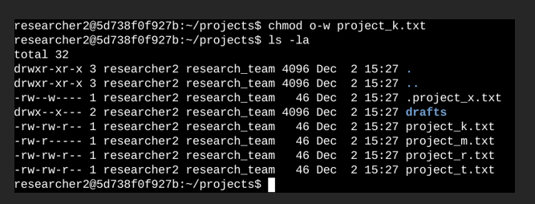
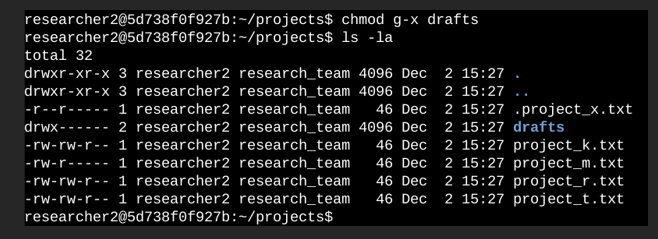

# 🔐 File Permissions Management in Linux

This repository documents a hands-on task completed as part of the **Google Cybersecurity Analyst course**, focusing on analyzing and modifying file and directory permissions in a Linux environment. The objective was to strengthen system security by controlling who can read, write, or execute specific resources.

> 📌 **Note:** The full report is in **Spanish**, as the course was taken in that language.

## 📄 Full Report (PDF)
📎 [View detailed report in PDF](./permisos_archivos_linux_actividad_cartera.pdf)

The document includes step-by-step explanations, terminal commands, and screenshots showing the entire process.

---

## 📁 Project Description

The research team at my organization needed to update file permissions for certain files and directories inside the projects directory. Currently, the permissions do not reflect the appropriate level of access. Reviewing and updating these permissions helps ensure system security. To complete this task, I followed these steps:

🔍 Checking File and Directory Details
I used the ls -la command to list all contents (including hidden files) of the projects directory. The output shows a directory called drafts, a hidden file .project_x.txt, and several other project files. The 10-character string in the first column indicates the permissions for each file or directory.

🔤 Understanding the Permission String
Each 10-character permission string can be broken down as follows:

1st character: Type of file (d for directory, - for file).

2nd–4th: Read (r), write (w), execute (x) permissions for the user.

5th–7th: Permissions for the group.

8th–10th: Permissions for others.

---

### ✏️ 2. Changing File Permissions with `chmod`
The organization required that "others" should not have write access to any files. To comply, I removed the write permission for others on project_k.txt using chmod. I then verified the change with ls -la.

---

### 🕵️‍♂️ 3. Changing Permissions on a Hidden File
The file .project_x.txt was archived and should not be writable by anyone, but both the user and group should retain read access. Using chmod, I:

Removed write permissions from the user (u-w)

Removed write permissions from the group (g-w)

Added read permission to the group (g+r)

---

### 🔒 4. Restricting access to a private directory ( Changing Directory Permissions)

Only the user researcher2 should have access to the drafts directory. I removed execute permissions for the group, ensuring only researcher2 could access it.

---

## ✅ Summary

I updated several file and directory permissions to match the intended authorization levels inside the projects directory. The process started by checking permissions with ls -la, followed by using chmod to make targeted adjustments.

---

